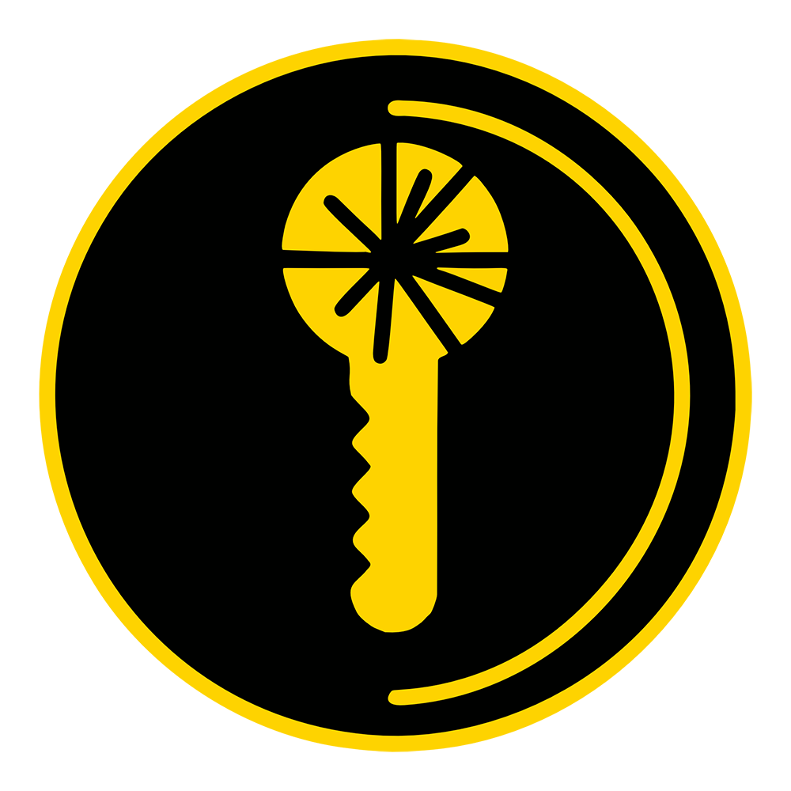

# team-42 Platanus Hack Project

  

Submission Deadline: 23rd Nov, 9:00 AM, Chile time.

Track: ☎️ legacy

team-42

- Vicente Matus ([@vicentematus](https://github.com/vicentematus))
- Tomas Fernandez ([@tomasft0410](https://github.com/tomasft0410))
- Ignacio Muñoz Repetto ([@itmunoz](https://github.com/itmunoz))
- Diego Costa ([@diegocostares](https://github.com/diegocostares))
- Benjamín Vicente ([@benjavicente](https://github.com/benjavicente))

## Resumen

Los procesos de onboarding son lentos.

Te piden mucha informacion una y otra vez.

El tramite de acreditacion de informacion es lento.

Para eso existe "GoBoard".

Te ahorramos la pega de tener que buscar y lidiar con informacion duplicada en distintas partes.

Verificamos documentos en el momento.

Nos integramos con tu identity provider (OAuth + OIDC).

Deja de pedir los mismos datos una y otra vez. Pidelos una vez a tu usuario, y

Onboardea tus usuarios en minutos, en vez de esperar dias.

Ten gobernanza de tus datos.

Plug and play con tu app.

Somos tu solucion de identidad global.
