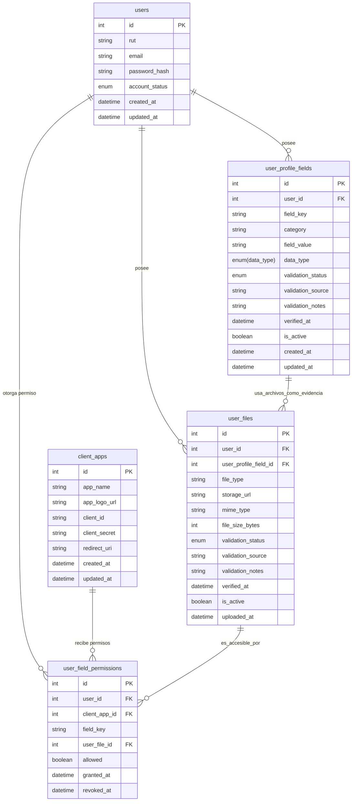

# Diagrama de datos

## 🧩 ENUMS UTILIZADOS

Para que quede claro cómo se interpretan:

### **validation_status**

* `pending`
* `verified`
* `rejected`
* `not_requested`

### **data_type**

* `string`
* `number`
* `date`
* `boolean`
* `file` (si aplicara en futuro)

### **account_status**

* `active`
* `blocked`
* `pending_verification`